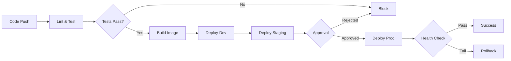

# CI/CD Pipeline Documentation

## Overview
IDP-Lite uses GitHub Actions for continuous integration and deployment across multiple environments.

## Pipeline Stages

### 1. Lint and Test
**Trigger**: Every push and pull request

**Steps**:
- Python linting with `ruff`
- Unit and integration tests with `pytest`
- Dashboard build verification

**Purpose**: Ensure code quality before deployment

### 2. Build
**Trigger**: Successful tests on `main` branch

**Steps**:
- Build Docker image for Control Plane API
- Tag with commit SHA
- Upload as artifact for deployment stages

**Output**: `idp-lite-api:${SHA}`

### 3. Deploy to Dev
**Trigger**: Successful build

**Environment**: `dev`

**Steps**:
- Download Docker image artifact
- Deploy to dev environment
- Run smoke tests

**Purpose**: Rapid feedback for developers

### 4. Deploy to Staging
**Trigger**: Successful dev deployment

**Environment**: `staging`

**Steps**:
- Deploy same image to staging
- Run full integration test suite
- Verify all endpoints

**Purpose**: Pre-production validation

### 5. Deploy to Production
**Trigger**: Successful staging deployment + manual approval

**Environment**: `production`

**Steps**:
- Tag image for production (`prod-${SHA}`)
- Deploy to production cluster
- Run health checks
- Keep previous version for rollback

**Purpose**: Controlled production releases

### 6. Rollback (On Failure)
**Trigger**: Production deployment failure

**Steps**:
- Automatically revert to previous production version
- Notify team
- Preserve failed deployment for debugging

## Environment Configuration

### Dev
- Auto-deploy on every merge to `main`
- No approval required
- Ephemeral data

### Staging
- Mirrors production configuration
- Requires dev success
- Persistent data for testing

### Production
- Requires manual approval (GitHub Environments)
- Blue-green deployment strategy
- Automatic rollback on health check failure

## Promotion Gates



## Rollback Strategy

### Automatic Rollback
Triggered when:
- Health checks fail post-deployment
- Critical metrics breach thresholds
- Deployment timeout

### Manual Rollback
```bash
# Via GitHub Actions
gh workflow run cicd.yml -f rollback=true -f version=prod-abc123

# Via kubectl (if using Kubernetes)
kubectl rollout undo deployment/idp-api -n production
```

## Secrets Management
- GitHub Secrets for credentials
- Environment-specific secrets
- Rotation policy: 90 days

## Monitoring
- Deployment notifications to Slack
- Metrics tracked: deployment duration, success rate, rollback frequency
- Alerts on deployment failures

## Example Workflow Run
1. Developer pushes to `main`
2. CI runs tests (2 minutes)
3. Image builds (1 minute)
4. Dev deployment (30 seconds)
5. Staging deployment (30 seconds)
6. Manual approval requested
7. Production deployment (1 minute)
8. Health checks pass
9. Deployment complete (Total: ~5 minutes)
